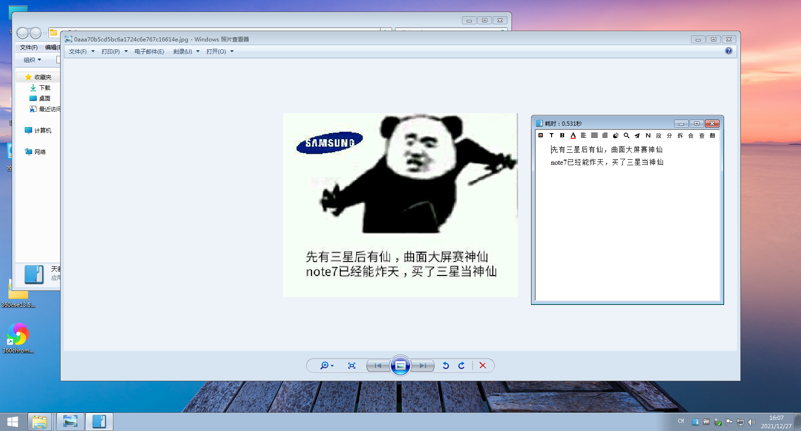

# tianruoocr-cl

#### 介绍

  

天若ocr开源版本的本地版，采用Chinese-lite和paddle-ocr识别，再也不用网络啦

推荐paddle-ocr识别，可以在识别结果里面切换接口

本软件离不开以下仓库、软件的帮助，在此表达崇高的感谢：
> https://gitee.com/ZZK-1989/tianruoocr

> https://github.com/DayBreak-u/chineseocr_lite/tree/onnx/dotnet_projects/OcrLiteOnnxCs

> https://github.com/RapidAI/RapidOCR

软件为64位系统使用，win10/win7都行，没有测试win11，需要.net4.7.2

本程序主要靠粘贴复制，要是有大佬帮忙改改就好了

中文识别率还是很舒服的

线程设的4，可以修改

本软件不具备任何捐赠的地方，也欢迎大家传播使用，软件作者是机械专业学生，不具备太多编程能力，大部分问题都是自己百度谷歌解决，有问题欢迎交流。

## 注意
-----
1. 编译的话需要引用Microsoft.ML.OnnxRuntime.dll，如果是为了win7能用可以引用我编译好的（在dll和runtime文件夹），也可以自己编译，需要把对应onnxruntime.dll放在运行文件夹中。如果不使用win7，可以直接使用nuget安装即可。
2. 更改nuget包管理为PackageReference，应该不要packages了，编译之前请先安装nuget的一堆包
3. 编译的话注意AdvRichTextBox.Designer.cs文件，必须重写，这个文件在切换的过程中有可能会被系统自动覆盖，需要复制回来
## 问题汇总
-----
1. ~~win7无法使用，基本无解~~（V1.3 win7已经可以用了）
2. 如果出现`Exception from HRESULT: 0x8007007E`可以使用dx修复工具进行修复，一般能够启动
3. 请尝试安装vc++运行库，net4.7.2
4. 谷歌翻译基本不会维护，~~请大家尽量使用百度翻译~~，（添加了其他翻译）稳定可靠

## 目前模型
|模型名称|det模型|rec模型|cls模型|
|:---:|:---:|:---:|:---:|
|Chinese-lite|默认|默认|默认|
|paddle-ocr|ch_PP-OCRv3_det_infer.onnx|ch_PP-OCRv2_rec_infer.onnx|ch_ppocr_mobile_v2.0_cls|

## 翻译说明
----
### 翻译问题说明
1. 目前离线翻译建立在python搭建模型和建立服务器，本软件只负责与搭建的网站对接，因此需要一定的python基础和运行环境，如果不能运行请尝试自己解决，作者也无能为力。
2. 由于离线翻译网站属性，实际上可以自行搭建服务器，只要满足post格式就行，post一共两个参数，“mod”和“text”，mod为zh2en，en2zh，ja2zh，zh2ja，分别代表对于语言，text为待翻译文本，直接返回翻译结果即可。
3. 对于谷歌翻译，不能用的情况，请大家各显神通。
4. 如果需要添加我其他翻译接口，请确保翻译接口1.可以很好的申请（例如微软翻译我没有信用卡我没法申请）2.接口api良好，至少我可以学习3.接口不是那种限时的（例如有道，只有免费一点钱用完就没了，不符合我很久用一次也可以不失效的想法）
5. 离线翻译耗时很久，没有gpu加速，理论上可以让gpu加速，但是我没弄
### 服务器搭建说明
1. 服务器搭建需要以下（[参考网址](https://blog.csdn.net/mzl87/article/details/127123445)）：
   1. python 3.8
   2. flask
   3. gevent
   4. transformers
   5. sentencepiece
   6. torch
2. 安装好后运行translation.py，第一次会下载离线识别包，比较大，1个多G，且运行占用内存也1个G，请自行考虑电脑，如果有下载好的模型可以更改脚本中path位置到本地地址，注意路径中不能有中文，之后不需要再次下载
3. 在软件设置翻译api-离线翻译-网址中输入网址http://127.0.0.1:16888/wesky-translater（如果是搭建在其他服务器上，替换127.0.0.1为相应ip）
### 其他说明
1. 如果有大佬能够打包，请联系我，我放到文中
2. 如果出现奇怪问题，联系我也没用，受限于作者知识水平有限

## 下载地址
----
> https://gitee.com/wanglifree/tianruoocr-cl/releases

> https://github.com/wangfreexx/wangfreexx-tianruoocr-cl-paddle/releases

## 下一步目标
----
1. ~~离线翻译~~
2. 重构截图
3. 增加图片二值化，提高识别率

## 版本更新说明
----
### v1.3.9（2023.5.30）
1. 更新ZXING，现在能够识别条码
2. 添加了用户自定义宽高的设置，可以在其他特性中设置长宽高，但需要注意程序有最小长宽，小于最小的值不生效，当设置全为0时程序会自己默认长宽
### v1.3.8.2（2023.4.14）
1. 删除了部分没用的图标，例如拆分，朗读等
2. 修正了静默识别和静默复制会自动处理文本的问题，除非在界面默认合并（合并图标右键-变红），否则复制到粘贴板为原始文本（带换行）
### v1.3.8.1（2023.1.4）
1. 优化适配高分辨率屏幕，可以在设置中单独设置图标和文字缩放倍数，可以放大界面
### v1.3.8（2023.1.4）
1. 默认取消静默识别
2. 假装适配高分辨率屏幕，可以在设置中设置缩放倍数，可以放大界面，除了翻译界面文字不知道为啥不缩放外，其他均会缩放
3. 添加按钮可以在末尾添加换行
4. 代理可以使用，仅针对谷歌翻译有用，其他无效
### v1.3.7（2022.11.21）
　 *注意：* 默认是静默识别，请去设置里面修改，将在下个版本取消默认 

1. 修改ocr识别、翻译字体为微软雅黑
2. 添加腾讯、彩云（均需要api）、离线翻译（具体查看翻译说明）
3. 添加静默识别和默认复制选项
4. 在设置上添加版本号好识别
5. 解决识别后的文字在创建文件夹提示非法字符的bug
6. 由于更新东西影响存储结构，更新需要删除Data-my.Config，让程序自己重新生成，请合理保留配置
7. 重新编译ShareX.ScreenCaptureLib.dll，修正快捷键A保存图片不能使用的bug（如果不行，请更新最新的1.3.7（之前上传的1.3.7没有修正））
### v1.3.6（2022.11.8）
1. 修复百度翻译只能翻译第一行的bug
2. 修复每次识别后多出一行换行符号的bug
3. 切换识别后为微软雅黑字体，但翻译字体没动
### v1.3.5（2022.8.14）（非重要更新，非区域问题可不下载）
1. 彻底抛弃ini结构，采用xml结构utf8储存配置，适应不同语言环境（非unicode语言为中文以外的情况）
2. 修改paddle默认参数适应小框识别的问题 [I5LRD0](https://gitee.com/wanglifree/tianruoocr-cl/issues/I5LRD0)
### v1.3.4（2022.8.10）
1. 彻底解决paddle识别率不高的bug
2. 不再使用fody合并dll
### v1.3.3（2022.8.7）
1. 更新了paddle为v3模型，与RapidOCR一致，
2. 关于之前反馈的模型识别率更低了的问题，我自认为解决了（并没有解决，心态爆炸，就算替换模型也不如1.2.5版本，咋回事啊，那咋整啊，但是只要切换一次cl再切回paddle，paddle又好使了，心态确实不好了，我决定有空好好弄下，但不是现在）
3. 更改nuget包管理为PackageReference，更新emgu等库
4. 解决了在不同语言环境下读取ini文件的问题，ini文件现在编码为unicode编码
### v1.3.2（2022.3.11）
1. 修改了模型名称，方便更新替换。同时更新了paddle的模型，与RapidOCR一致，准确率有提升的。
### v1.3.1（2022.1.29）
1. 修正了开启默认合并行数据丢失的问题
2. 使用fody合并dll，减小文件数量
### v1.3（2021.12.27）
1. Win7也能用了！（详请见更新说明）
2. 段落合并功能bug修复
3. 尝试解决识别文本和显示不一样的bug，也就是识别框出现很多重复文字的bug（实际没有这些文字，只是显示而已）
4. 谷歌翻译采用“ZZK-1989”大佬的方式，更加快速，且支持段落识别，但是能不能翻译全凭网络流畅与否
5. 切换模型和修改模型不再需要重启应用，只需要随便切换一次模型即可（将载入模型放在了切换模型的位置）
### v1.2.6
1. 修正一个编译bug（具体情况是编译识别为空）
2. 更加合理的段落合并功能，拆分按钮现状不会清空文字了，但是依然没用
3. 采用64位编译
### v1.2.5
1. 把原来删除的百度在线ocr给撤销回来了，现在可以使用了，并且加入了错误检测，避免崩溃
2. 段落翻译增加了延时，避免ip被封
### v1.2.4
1. 添加了保留段落翻译，不再合并段落翻译，切换接口即可，由于单独翻译，速度可能稍慢
### v1.2.3
1. 添加了参数帮助（注释）
### v1.2.2
1. 修复了不能重启的bug
### v1.2.1
1. 修复了不能切换模型的bug，初始paddle模型是选的英文
### v1.2
1. 更新了翻译接口，现在谷歌和百度可以用了！换行会自动处理成量起来的，方便pdf。百度需要申请API
2. 添加了几个轻量模型（日文和英文专精），切换需要重启
3. 修复了部分bug，清理了部分源码
4. ~~应该不会再更新了！~~

### V1.1
1. 添加了paddle-ocr支持，模型并不大，速度快！
2. 可以切换接口了，虽然工程里面名字还是其他名字，但是编译出来的不会显示搜狗和腾讯了
3. 优化了内存占用（每次识别完自动清理内存）

### V1.0
1. 添加了Chineseocr-lite支持，使用原来搜狗的接口选项

## 一些碎碎念
----
### v1.3.8
感觉很多“伪”需求（之所以说伪是因为我觉得用不到），精力有限，不再更新，除了部分bug修复，当然如果能有偿还是可以考虑，只是违背初心
### v1.3.7
封校带来的更新，可以彻底离线了，满足我当初的愿望了
### v1.3.6
关于本人目前正在研三关键时期，最近精力有限，无法及时解决各种问题，且本身不是程序员出生，对于很多问题其实我也无能为力，全部重构没有必要，本来就是满足离线为主，之后会想办法加入离线翻译，彻底离线。
### v1.3.4
一杯茶一包烟，一个bug调一天，paddle识别不高的原因是因为模型所设置参数没有初始化，导致第一次时候程序识别不行，但是切换下模型相当于初始化又好了。。。。具体问题在438行，调用的参数错误
### v1.3.3
win7编译后需要手动替换onnxruntime.dll，版本为1.6，vs nuget中的不支持win7，github上下载的支持。尝试解决读取ini文件的问题，本来想改成utf8格式读取，但是试了很久都不行，用了大概3天一无所获，不过今天用了别人的库一下就没问题了...........还是crtlv好用
### v1.3
win7支持源自与逛吾爱时看到有大佬做出来ncnn和onnx的差不多的天若本地版，目的就是解决我的不支持win7的问题，可惜没有开源，但是大佬提供了思路，然后顺着大佬思路，我也自己编译了onnxruntime，得益于微软的开源，编译很简单，然后又修正了下库的引用，在win7上真的跑起来了（我用了虚拟机）。我编译的是onnxruntime 1.5.2版本，1.6我试了好像不支持了，具体不清楚。当然大佬还做了其他差异化的东西，例如二维码，局域网网页调用，我就没做了，自己还是太菜，应该不会再更新了，算是圆满了，这个项目其实只是简单粘贴复制，方法很菜，希望有朝一日能给大家提供一点微薄的帮助。

## Stargazers over time
----

## License
----
GPL-3.0 license

